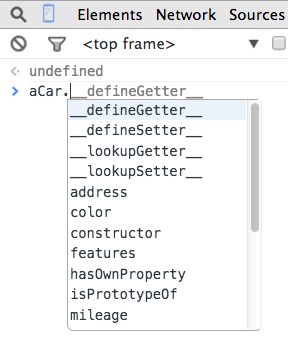

## Start-up.

Download the sample code supporting the lecture slides (available on Moodle or [here](./lab1_files/samplecode.zip) ) and unzip it. Open a terminal/shell/DOS window, use the _cd_ command to relocate to the folder containing the unzipped files and run the first sample, as follows:

    $ node 01_primitives.js

[Note: As a convention, we use the dollar symbol ($) to represent the terminal prompt - you do not type it as part of a command.]

The screen-shot shows the result expected.

Examine the file `02_objects.js` in the folder and run it:

    $ node 02_objects.js

Ensure you understand how it generated its output.

Now create a new folder called `lab01` and inside it create a new file named `fundamentals.js`. Paste this code into the file:

           var aCar = {
            owner : "Joe Bloggs",
            type : 'Toyota Corolla 1.8',
            registration : '10WD1058'
        }

        console.log(aCar.owner)

Open a second shell/DOS window, go to the new folder (using the cd command) and run it, as follows:

    $ node fundamentals.js 

## Nested Objects.

[First examine the file `04_nested_objects.js` from the sample code, run it and ensure you understand how it generated its output.]

Switch your attention back to the `fundamentals.js` file.

A car’s type can be broken down into three parts: Make (Toyota), Model (Corolla), and CC (1.8). Change the value of the _type_ property of _aCar_ from a string to an object, where the inner object’s properties are _make_, _model_ and _cc_. To prove your change worked, add this line to the bottom of the JS file:

    console.log(aCar.owner + ' drives a ' + aCar.type.make)

and run it as before:

    $ node fundamentals.js 

It should display: **Joe Bloggs drives a Toyota**.

[See [Solution 01](./lab1_files/solutions.html) for the completed code.]

A car’s registration is also composed of three distinct elements; year, county code, and number. Use an inner object for the _registration_ property to reflect this structure and aksi add a ‘console.log’ statement that displays the following: **Reg. = 10-WD-1058**.

[See [Solution 02](./lab1_files/solutions.html) for the completed code.]

## Dynamic properties.

[First examine the file `03_dynamic_objects.js` from the sample code, run it and ensure you understand how it generated its output.]

Objects are dynamic in that new properties can be added at any stage after initialization. The syntax is :

> > object.new_property = value e.g. aCar.property = value

Using this syntax, add two new properties to _aCar_:

1.  Mileage - set this to 80000.
2.  Color - two colors apply, exterior (red), and interior, where the latter has two attributes, namely, texture (say, leather) and shade (say, cream).

Then add a ‘console.log’ statement that displays these details, as follows : **It is a red car, 80000 mileage, and leather interior.**.

[See [Solution 03](./lab1_files/solutions.html) for the completed code.]

## Arrays.

[First examine the file `05_arrays.js` from the sample code, run it and ensure you understand how it generated its output.]

Add a previous owners property to _aCar_, as follows:

        var aCar = {
            owner : 'Joe Bloggs',
            previous_owners : ['Pat Smith - 1 Main Street', 
                                'Sheila Dwyer - 2 High Street'],
            . . . . . . 
            registration : {year : 10, county : 'WD', number : 1058}
        }

This new property is an array of strings. To test it, add this statement to the bottom of the file:

        console.log('First owner : ' + aCar.previous_owners[0] )

and run the code as before:

        $ node fundamentals.js 

The last line displayed by the code will be: **First owner : Pat Smith - 1 Main Street**.

A better design for the previous owners property would be array of objects, where the objects’ form is:

          { name : ' .......', address : '.......'}

You are required to change the _previous_owners_ array to reflect this redesign and rewrite the ‘console.log’ statement so that it still displays the same information.

[See [Solution 04](./lab1_files/solutions.html) for the completed code.]

For completeness, add a property to _aCar_ for the current owner’s address, as follows:

        var aCar = {
            owner : 'Joe Bloggs',
            address : '3 Walkers Lane',
            . . . . . . .
            registration : {year : 10, county : 'WD', number : 1058}
        }

## Looping/Iteration constructs.

Suppose the car has a list of extra features. We can represent this as a simple array of strings, as follows:

        var aCar = {
            owner : 'Joe Bloggs',
            . . . . . . . 
            features : ['Parking assist', 'Alarm', 'Tow-bar'],
            registration : {year : 10, county : 'WD', number : 1058}
        }

At the end of the file, add a for-loop to display this list, as follows:

        for (var i = 0 ; i < aCar.features.length ; i += 1) {
            console.log(aCar.features[i])
        } 

Run the code to prove it works:

        $ node fundamentals.js 

You are required to write another for-loop that displays the name (not their address as well) of each previous owner.

[See [Solution 05](./lab1_files/solutions.html) for the completed code.]

The for-loop for iterating over an object’s properties is slightly different. For example, to display the key-value pairs in the _type_ property, add the following code to the end of the file:

        for (var p in aCar.type)  {
            console.log(p.toUpperCase() + ' = ' + aCar.type[p] )
        }

Run the code to prove it works. Note the expression `aCar.type[p]` in the above excerpt. It demonstrates the subscript notation for accessing an object’s properties, e.g. aCar[‘owner’], aCar.type[‘make’]. To-date we have used the dot notation (aCar.owner), however this will not work in the above excerpt as the variable _p_ is a string.

* * *

# The Browser as a Javascript Development tool.

So far we have used the **node.js** platform to execute JS code, however, the Web Browser was the original execution environment. In recent years browser vendors have been add excellent _Developer Tools_ to assist with debugging web applications. In this lab we will introduce the developer tools in the [Google Chrome](https://developer.chrome.com/devtools) browser - other browsers have similar tools. [You should install this browser to complete the lab.]

To demonstrate the tools, we will paste the JS code developed so far into a blank web page. Download [this file](./lab1_files/demo.zip), unzip it and study the content. Open the `demo.html` web page in the Chrome browser. Although the page is blank, the JS code inside the ‘script’ tag has been executed. To prove this, open the Developer tools by clicking the Chrome menu icon on the top right and selecting the tools, as illustrated below:

The tools window appears at the bottom of the browser and the **Console** tab is selected as the default (if not then select it manually). All the log statements from our JS code appear in the console view, as illustrated below:

The console allows us interact with the JS code by typing statements at the prompt. [In a later lab we will use the console to interact with the web page currently being displayed]. At the prompt, type the statement:

          aCar.owner

and notice the response (see illustration)

We can change any object property, for example, type these two commands at the prompt:

        aCar.color.exterior = 'blue'
        aCar.color.exterior

The Console attempts to evaluate any JavaScript expression you enter at the prompt. It also provides **auto-completion and tab-completion**. For example, as you type expressions, property names are automatically suggested (see illustration). If there are multiple properties with the same prefix, pressing the Tab key cycles through them. Pressing the right arrow key accepts the current suggestion.

You will notice that an object has a number of properties not explicitly defined - see illustration. These are defined for all objects by default - some are useful.

When a statement returns an object, rather than a primitive, you can expand the object to see its property detail.

The tools will be very useful for debugging application code later in the semester.
