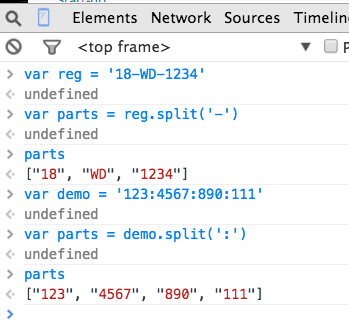

# Javascript (JS) Functions.

The related sample code accompanying the Javascript lecture slides (available [here](https://moodle.wit.ie/pluginfile.php/1555674/mod_resource/content/3/lab3/source/functions.js)) should be used as a guide to implementing the exercises for this lab.

## Start.

Use [this JS code](./javascript-lab_files/lab_functions.js) as the starting point for this lab exercise. Open the downloaded file and examine its initial content.

## Functions.

[In the sample code provided with the lecture slides (functions.js), review the section demonstrating _function declarations, variable scopes and function expressions_. ]

Suppose we want a function that adds an entry to the _previous_owners_ property of _aCar_. Add the following function expression statement to the end of `lab_functions.js`:

        var addPreviousOwner = function(car,p_name,p_address) {
               var o = { name : p_name, address : p_address }
               car.previous_owners.push(o)
         }

Recall, the _push_ function adds the new entry to the end of the array. To prove this code works, add the following statements after the function expression:

        addPreviousOwner(aCar,'Jim Nugent','3 Lower Road')
        console.log(aCar.previous_owners[aCar.previous_owners.length - 1].name)

The ‘console.log’ statement accesses the last entry in the _previous_owners_ array - at index ‘length - 1’. Now run the code:

         $ node lab_functions.js

Let’s assume we decide to keep a record of only the three most recent previous owners of a car. When we try to add a fourth person then the first owner should be removed from the record, leaving the second owner as the first entry in the array. A similar procedure should be applied when we add a fifth and subsequent previous owner - the array never has more than three entries. You are required to change the implementation of the _addPreviousOwner_ function to meet this requirement. To test your solution, add the following to the end of the ``lab_functions.js` file:

         addPreviousOwner(aCar,'Rachel Fleming','4 Upper Road')
         console.log(aCar.previous_owners[2].name)
         console.log(aCar.previous_owners[0].name)

The two log statements should display the names Rachel Fleming and Sheila Dwyer.

[See [Solution 01](./javascript-lab_files/solution.html) for the completed code.]

## Variable scopes.

In the _addPreviousOwner_ function above it was not necessary to have _aCar_ as an argument since this variable has **global scope**. Therefore the function expression could be reduced to:

        var addPreviousOwner = function(p_name,p_address) { ... body ... }

and in the body of the function all references to _car_ should be changed to _aCar_.

[However, in general it is considered good practice to have functions independent of global scope. This enhances the function’s re-usability.]

The variable _o_ declared inside the function is not accessible in global scope. To prove this, add the following log statement to the end of the file:

       console.log(o.name)

and run the code. An error is thrown to indicate o is not defined. Remove the log statement again to get rid of the error.

## Methods.

[In the sample code provided with the lecture slides, review the section demonstrating _methods_.]

The _addPreviousOwner_ function above should really be a method of _aCar_. To achieve this, make the following addition to _aCar_:

        var aCar = {
            . . . . . . . 
            addPreviousOwner : function(p_name,p_address) {
                   var o = { name : p_name, address : p_address }
                   if (this.previous_owners.length == 3) {
                      this.previous_owners.shift()
                   }
                   this.previous_owners.push(o)
                },
            previous_owners : [ { name : 'Pat Smith', address : '1 Main Street'}, 
                                { name : 'Sheila Dwyer', address : '2 High Street'}],
            . . . . . . . .
        }

Note, the keyword ‘this’ is used inside the method to reference the containing object (aCar). We should now remove the old _addPreviousOwner_ function expression and replace all calls to that function with method calls instead. The method calls will be as follows:

         aCar.addPreviousOwner('Jim Nugent','3 Lower Road')
         aCar.addPreviousOwner('Rachel Fleming','4 Upper Road')

You are required to add another method to _aCar_, called _newOwner_. This method changes the owner details and adds the current owner to the list of previous owners. Test your method implementation by adding the following statements to the end of the file:

        aCar.newOwner('Donal Dunne','5 Kings Way')
        console.log(aCar.previous_owners[2].name)
        console.log(aCar.owner)

The log statements should display the names Joe Bloggs and Donal Dunne. [Hint: A method of an object can call another method (of the same object). Simply prefix the called method with _this_, e.g. this.otherMethod(. . . )]

[See [Solution 02](./javascript-lab_files/solution.html) for the completed code.]

## Methods/Function return.

[First examine the relevant section of the sample code from the lecture and then continue.]

Add the following method to the car object:

        var aCar = {
            . . . . . . . .
            howOld : function() {
                   var today = new Date()
                   var this_year = today.getFullYear()
                   return this_year - (this.registration.year + 2000)
                },
            . . . . . . . . . 
        }

It computes how old the car is, in years. To test it, add the following log statement to the end of the file:

        console.log(aCar.howOld())

and run it:

         $ node lab_functions.js

[The Date feature used in the above method is interesting. You can experiment with it in the Google Chrome Developer tools console, as illustrated below:

For some method a boolean (true/false) is the appropriate return value. For example, a method that determines whether a car has a certain feature (yes/no) would look as follows:

        var aCar = {
            . . . . . 
            addPreviousOwner : function(p_name,p_address) { 
                . . . . . 
                },
            hasFeature : function(feature_in) {
                var result = false
                this.features.forEach(function(feature) {
                if (feature_in.toUpperCase() == feature.toUpperCase() ) {
                   result = true
                   }
                })
                return result
                },
            . . . . . . 
        }

[For maximum user convenience, the method is made case-insensitive by temporarily converting everything to upper-case.]

To test this method, add the following to the bottom of the file:

        console.log('Alarm :' + aCar.hasFeature('alarm') )

and run the code.

You are required to implement a method that determines if a particular person (name) was a previous owner of the car. To test your implementation add the following to the end of the file:

         var name = 'Jim Nugent'
         console.log(name + ' ? ' + aCar.wasOwnedBy(name))
         name = 'Paul Minihan'
         console.log(name + ' ? ' + aCar.wasOwnedBy(name))

The result should be:

        Jim Nugent ? true
        Paul Minihan ? false

[See [Solution 03](./javascript-lab_files/solution.html) for the completed code.]

## Constructors.

Instead of using the literal syntax for creating the car object above, a constructor could be utilized - instantiating other car objects would be much easier as a consequence. For convenience, we will use a separate file, called `constructor.js` for the remainder of the lab. Create the file and paste in the following code:

        function Car(name_in,address_in,make_in,model_in,cc_in) {
            this.owner = name_in
            this.address = address_in
            this.previous_owners = [ ]
            this.type = { make : make_in, model : model_in, cc : cc_in }
            this.addPreviousOwner = function(p_name,p_address) {
                   var o = { name : p_name, address : p_address }
                   if (this.previous_owners.length == 3) {
                      this.previous_owners.shift()
                   }
                   this.previous_owners.push(o)
                }
            this.wasOwnedBy = function(name_in) {
                var result = false
                this.previous_owners.forEach(function(owner) {
                var name = owner.name.toUpperCase()
                if (name_in.toUpperCase() == name) {
                   result = true
                   }
                })
                return result
                }
        }

        var car1 = new Car('Joe Bloggs','3 Walkers Lane','Toyota','Corolla',1.8)
        car1.addPreviousOwner( 'Pat Smith', '1 Main Street')
        car1.addPreviousOwner( 'Pat Smith', '1 Main Street')
        car1.addPreviousOwner( 'Sheila Dwyer', '2 High Street')
        console.log('Path Smith ? ' + car1.wasOwnedBy('Pat Smith'))

[Note, this code is not yet complete.] Take some time to study it and then run it:

        $ node constructor.js 

In the original _aCar_ object we had a _newOwner_ method. You are required to add this method to the _Car_ constructor and then test your solution by adding the following to the end of the `constructor.js` file:

        car1.newOwner('Donal Dunne','5 Kings Way')
        console.log(car1.previous_owners[2].name)
        console.log(car1.owner)

The log statements should display Joe Bloggs and Donal Dunne.

[See [Solution 04](./javascript-lab_files/solution.html) for the completed code.]

The car registration details are not yet supported by our constructor. While this information is stored internally in a nested object, we don’t need to expose this to the constructor user. Using a simple string as the constructor parameter seems more natural, e.g. Car (….,‘10-WD-1058’). To satisfy this requirement our constructor must parse the registration string and place the elements in the nested object. JS has a special string method called _split_ for parsing strings. You can experiment with it in Chrome’s Developer Tools console, as illustrated below:

The _split_ methods segments a string based on a given character, ’-’ in the above example. The methods returns an array containing the segments.

Now update the car constructor to make use of this feature, as follows:

        function Car(name_in,address_in,make_in,model_in,cc_in,reg_in) {
            . . . . . 
            this.type = { make : make_in, model : model_in, cc : cc_in }
            var reg_parts = reg_in.split('-')
            var year = parseInt(reg_parts[0])
            this.registration = {year : year , 
                                 county : reg_parts[1], 
                                 number : reg_parts[2] }
            this.newOwner = function(p_name,p_address) { . . . }
            . . . . . . 
        }

[The parseInt() function converts a numeric string to an integer, e.g. ‘123’ to 123\. Experiment with it in Chrome’s Developer Tools console.]

You must now change the existing line of code that creates a car object to the following:

        var car1 = new Car('Joe Bloggs','3 Walkers Lane',
                           'Toyota','Corolla',1.8,'10-WD-1058')

To prove it all works, add the _howOld_ method, as follows:

        function Car(name_in,address_in,make_in,model_in,cc_in,reg_in) {
            . . . . . 
            this.howOld = function() {
                   var today = new Date()
                   var this_year = today.getFullYear()
                   return this_year - (this.registration.year + 2000)
                }
            this.newOwner = function(p_name,p_address) { . . . }
            . . . . . 
        }

and add this line to the end of the file:

        console.log('Car age: ' + car1.howOld()) 

The log statement should display ‘Car age: 5’.

* * *
