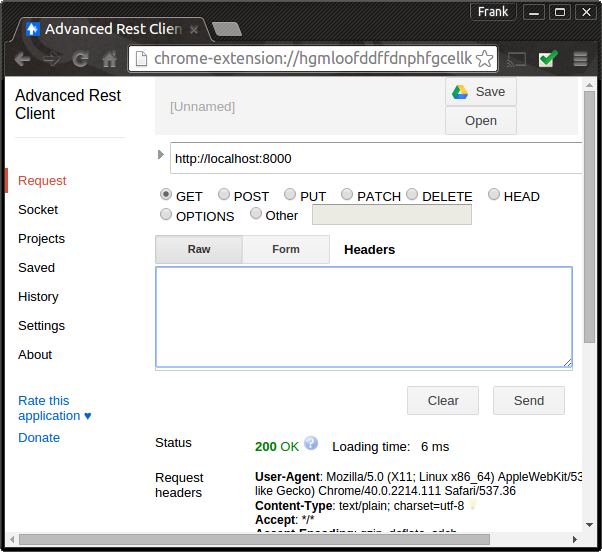

# Set up the Express Application


We will use the 'routing' technique covered in the last lab to map the above HTTP verb and paths

- Create a new project folder called *lab7* and do the following
  - Just like you did in lab 6, use Node Package Manager (NPM) to create a *package.json* file in the lab7 folder using ```npm init``` command.  
- Install Express and save the dependency to the package.json be running the following in the lab7 folder:
```npm install express --save```. (the ``--save`` adds Express dependency to your package.json)
- This time we'll also be parsing contact JSON in the HTML. We need the *body-parser* package for that. Install as follows: ```npm install body-parser --save```
- In the *lab7* folder, create a new script called **app.js** containing the following code:

```javascript
var express = require('express');
var bodyParser = require('body-parser');
//create an express app
var app = express();

//configure the express app to parse JSON-formatted body
app.use(bodyParser.json());

//add route for the root
app.get('/',function (request, response) {
  response.writeHead(200, {"Content-Type": "text/plain"});
  response.end("We're up and running!!!");
});
// Listen on port 8000, IP defaults to 127.0.0.1
app.listen(8000)
// Put a friendly message on the terminal
console.log("Server running at http://127.0.0.1:8000/");
```
* 
As in the last lab, start the service by running ```node app.js``` and then check if the Express app is listening on port 8000. This time, however, we will use a "Rest client" to manually test the service. If you are using the Chrome browser, you can use the 'Advanced Rest Client' which is available as a Chrome app. See [here](https://chrome.google.com/webstore/detail/advanced-rest-client/hgmloofddffdnphfgcellkdfbfbjeloo) for instructions on how to install the app.   
Once installed, perform a HTTP GET request on localhost:8000 as shown below. You should get a "200 OK" result if everything is OK.
