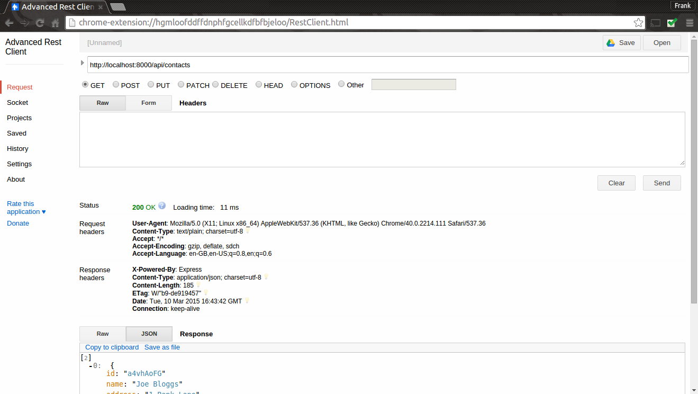
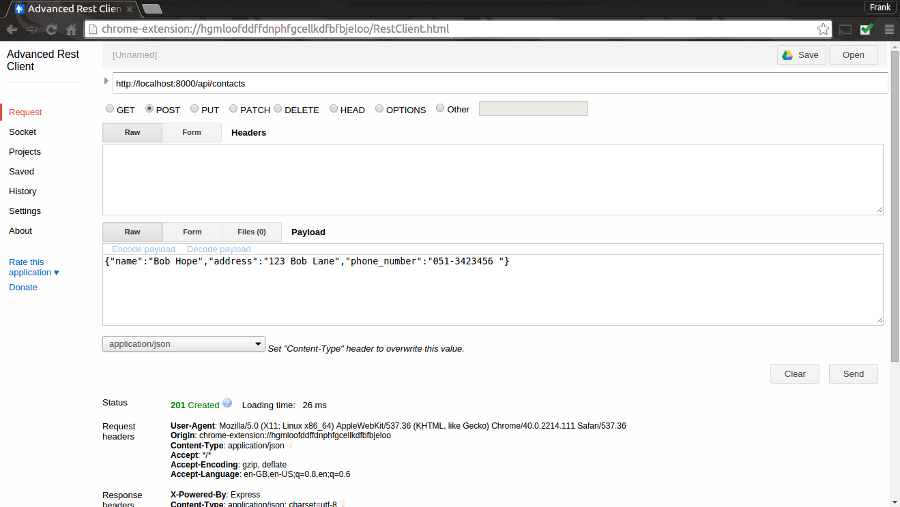

# Implementing Get and Post

* 
In **app.js**, update the code to require the routing script and the above routes.  
```javascript
//create routing object
var contact = require('./api/contacts/index');
//Add routes for contacts api
app.get('/api/contacts',contact.index);
app.post('/api/contacts',contact.create);
```
* 
Each contact's JSON representation will look like the following: 
```json
{id: 'hwX6aOr7', name: "Ellen Bliggs", address: "2 River Road", phone_number: "051-123457"}
```
We will need to generate a unique id each time a new contact is added. To do this, install the **ShortId** Module by running the following in the lab7 folder:  
```javascript
npm install shortid --save
```
* 
In the lab7 folder create the following folder structure.
```
 - api  
     |- contacts
```
To mimic a real database, we'll use a script that exports a hard coded contacts data as a JSON array. Create a new file called datastore.js in the *contacts* folder and add the following:
```javascript
exports.contacts = [ 
   {id: 'a4vhAoFG', name: "Joe Bloggs", address: "1 Bank Lane", phone_number: "051-123456 "},
   {id: 'hwX6aOr7', name: "Ellen Bliggs", address: "2 River Road", phone_number: "051-123457"}
]
```
* 
Create a new script called *index.js* in the contacts folder. Add the following code to the script.
```javascript
var datastore = require('./datastore');
var shortId = require('shortid');
// Get list of contacts
exports.index = function(req, res) {
    return res.json(200, datastore.contacts);
} ;
// Creates a new contact in datastore.
exports.create = function(req, res) {
    var contact = {
       id: shortId.generate(),
       name: req.body.name,
       address: req.body.address,
       phone_number: req.body.phone_number 
    };
    datastore.contacts.push(contact)
    return res.json(201, contact);
};
```
In the above code, we require the datastore script that exports the JSON array of contacts. The ``index`` function just returns all the contacts(i.e. the array). The ``create`` function creates a new new contact from the JSON contained in the HTTP body. Run the app again and, using your Rest client, test that it returns the contacts for a HTTP GET on localhost:8000/api/contact:


* 
Now test that you can add a contact to the contact list. Using your Rest client, do a HTTP POST on localhost:8000/api/contact, set the "content-type" to "application/json" and add the following into the payload:
```json
{"name":"Bob Hope","address":"123 Bob Lane","phone_number":"051-3423456 "}
```
See the screenshot below for guidance...


