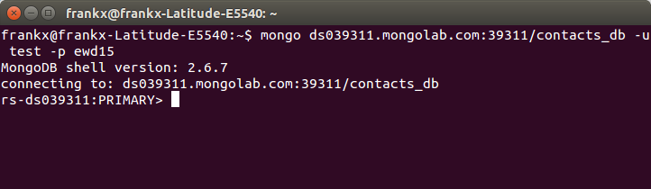

# MongoLab
 
MongoDB is a *noSQL* database, which means that it does not use traditional SQL and tables with rows and columns. Instead, it is a store for JSON documents, and allows these documents to be queried and manipulated, using JSON itself as the query language.

Running your own MongoDB cluster requires a significant amount of system administration work. You can outsource this to the cloud by using a MongoDB hosting provider.
The provider [MongoLAB](https://mongolab.com/) offers free  test databases that you can use to complete this practical.

MongoLab is a fully managed MongoDB-as-a-Service. It supports many of the features you expect including scalability, data protection, performance and availabilty. It also has a free sandbox feature that you can take advantage of to develop your application. 

###Create the database

 1. Create a free MongoLab account by following the instructions at [MongoLab ](http://mongolab.com).
 2. Create a new database called *contacts_db* with the following configuration:
  - **cloud provider:** *Amazon, location: EU(Ireland)*
  - **plan:** *Single Node, Sandbox (free)*
  - **database name:** *contacts_db*
 6. Select the database and click on the users tab.
 7. Create a new database user with username:* test *and password: *ewd15*.
 

### Create a Mongo client
 1. Download Mongo from [here](http://www.mongodb.org/) and install on your machine.
 2. We are only going to use the mongo client in this lab. To check it’s installed, go to the command line in the bin folder and run the following command: 
``mongo –version``.
 3. To connect to your new cloud database, use the connection string indicated in MongoLAB for connection using the shell. copy it into a terminal/command line as shown below:


 5. The MongoDB command line as a Javascript console. Try the following to illustrate this:
```
> var foo = 1+2
> foo
3
```
 6. Now insert some data into the DB using the following command:
 ```
 > db.contacts.insert({ name: "Joe Bloggs", address: "1 Bank Lane", age: 21,  phone_number: "051-123456 "})
 > db.contacts.find()
{ "_id" : ObjectId("55076970a67574f02cf6a6e9"), "name" : "Joe Bloggs","age": 21,  "address" : "1 Bank Lane", "phone_number" : "051-123456 " }
 ```
 The db object is provided by MongoDB and represents the current database in use. You can implicitly reference properties on the db object – for examples: db.contacts
This creates a “collection”, which is like a traditional SQL table. Thus ``db.contacts`` references a collection object, which has its own methods, one of which is “insert”.
To insert a document into the collection, just provide a JavaScript object literal. The document can be as complex as you like, and can contain sub objects and arrays.
The ``find()`` method, when used without arguments, returns a list of all documents in the collection. MongoDB automatically creates a unique identifier for each document – the ObjectID, with property *_id*. Go back to the mongolab website and click on the collections option to see the new contacts collection.
 7. Insert some more data:
```javascript
> db.contacts.insert({ name: "Ellen Bliggs", address: "2 River Road", age:23,  phone_number: [{type: "home", number: "051 12345"},{type: "mobile", number: "086 12345"}], email: "ebliggs@wit.ie"})
> db.contacts.find()
{ "_id" : ObjectId("5507d9e158a4e53928c21182"), "name" : "Joe Bloggs", "address" : "1 Bank Lane", "age" : 21, "phone_number" : "051-123456 " }
{ "_id" : ObjectId("5507da502d443a12b40d8b71"), "name" : "Ellen Bliggs", "address" : "2 River Road", "age" : 23, "phone_number" : [ { "type" : "home", "number" : "051 12345" }, { "type" : "mobile", "number" : "086 12345" } ], "email" : "ebliggs@wit.ie" }
```
Unlike traditional databases, MongoDB does not require a schema – you are not required to define your data structures in advance. You can insert any document into any collection. 

###Querying Data
MongoDB offers an easy query language. Of course, joins are not possible! Instead you “denormalize” by replicating data where needed.

1. To find matching documents, provide an example document:
```
> db.contacts.find({name:'Joe Bloggs'})
{ "_id" : ObjectId("55076970a67574f02cf6a6e9"), "name" : "Joe Bloggs","age":23,  "address" : "1 Bank Lane", "phone_number" : "051-123456 " }
```

2. Query conditions are specified using the ``$conditionName:{criteria...} ``syntax. For example, to find numeric values greater than 10, use: fieldName:{$gt:10}
```
> db.contacts.find({age:{$gt:21}})
{ "_id" : ObjectId("5507da502d443a12b40d8b71"), "name" : "Ellen Bliggs", "address" : "2 River Road", "age" : 23, "phone_number" : [ { "type" : "home", "number" : "051 12345" }, { "type" : "mobile", "number" : "086 12345" } ], "email" : "ebliggs@wit.ie" }
> db.contacts.find({age:{$lt:22}})
{ "_id" : ObjectId("5507d9e158a4e53928c21182"), "name" : "Joe Bloggs", "address" : "1 Bank Lane", "age" : 21, "phone_number" : "051-123456 " }
```
The condition names are as follows: ``
$gt = greater than, $gte = greater than or equal to, $lt = less than, $lte = less than or equal to, ``etc.
See [here](http://www.mongodb.org/display/DOCS/Advanced+Queries#AdvancedQueries) for more comprehensive instructions for querying. 

###Sorting Data
4. To sort data, use the chained sort method:
```javascript
> db.contacts.find({}).sort({name:1})
{ "_id" : ObjectId("5507da502d443a12b40d8b71"), "name" : "Ellen Bliggs", "address" : "2 River Road", "age" : 23, "phone_number" : [ { "type" : "home", "number" : "051 12345" }, { "type" : "mobile", "number" : "086 12345" } ], "email" : "ebliggs@wit.ie" }
{ "_id" : ObjectId("5507d9e158a4e53928c21182"), "name" : "Joe Bloggs", "address" : "1 Bank Lane", "age" : 21, "phone_number" : "051-123456 " }
> db.contacts.find({}).sort({name:-1})
{ "_id" : ObjectId("5507d9e158a4e53928c21182"), "name" : "Joe Bloggs", "address" : "1 Bank Lane", "age" : 21, "phone_number" : "051-123456 " }
{ "_id" : ObjectId("5507da502d443a12b40d8b71"), "name" : "Ellen Bliggs", "address" : "2 River Road", "age" : 23, "phone_number" : [ { "type" : "home", "number" : "051 12345" }, { "type" : "mobile", "number" : "086 12345" } ], "email" : "ebliggs@wit.ie" }
```
If you have too many results, you can limit the number of results using the limit() function:
```javascript
> db.contacts.find({}).sort({name:1}).limit(1)
{ "_id" : ObjectId("5507da502d443a12b40d8b71"), "name" : "Ellen Bliggs", "address" : "2 River Road", "age" : 23, "phone_number" : [ { "type" : "home", "number" : "051 12345" }, { "type" : "mobile", "number" : "086 12345" } ], "email" : "ebliggs@wit.ie" }
```
To return a subset of the document properties, use a second argument to the find function:
```javascript
> db.contacts.find({}, {name:1})
{ "_id" : ObjectId("5507d9e158a4e53928c21182"), "name" : "Joe Bloggs" }
{ "_id" : ObjectId("5507da502d443a12b40d8b71"), "name" : "Ellen Bliggs" }
```
##Updating Data
Because MongoDB does not provide traditional database ACID semantics, updates need more care than other database interactions. MongoDB does provide a set of “atomic” operations, in that these operations are guaranteed to complete before matching documents are modified by other updates. These can be used to provide certain forms of data integrity. 
1. Update operations consist of a query object and then an update object, providing the new data. The following updates the entire record for Joe Bloggs:
```javascript
> db.contacts.update({name:"Joe Bloggs"},{ name: "Joe Bloggs", address: "1 Bank Lane", age: 27,  phone_number: "051-123456 "})
WriteResult({ "nMatched" : 1, "nUpserted" : 0, "nModified" : 1 })
```
To update only specific properties, use $set and $unset
```javascript
> db.contacts.update({name:"Joe Bloggs"},{$set:{age: 30} })
WriteResult({ "nMatched" : 1, "nUpserted" : 0, "nModified" : 1 })
rs-ds039311:PRIMARY> db.contacts.find({name:"Joe Bloggs"})
{ "_id" : ObjectId("5507d9e158a4e53928c21182"), "name" : "Joe Bloggs", "address" : "1 Bank Lane", "age" : 30, "phone_number" : "051-123456 " }
```

 You can also perform “upsert” operations. In this case, a new document is created if no documents match the query. This is useful for intialising and updating counters using the $inc operator, which increments properties atomically:
```
> db.counter.update({name:'one'},{$inc:{count:1}},true)
> db.counter.find()
{ "_id" : ObjectId("4f3a4f9cc801a4b87bee6a12"), "count" : 1, "name" : "one" }
> db.counter.update({name:'one'},{$inc:{count:1}},true)
> db.counter.find()
{ "_id" : ObjectId("4f3a4f9cc801a4b87bee6a12"), "count" : 2, "name" : "one" }
```
An upsert is performed if the third argument to update is ``true``:
``db.counter.update({name:'one'},{$inc:{count:1}},true)``

###Removing Data
Remove operations are similar to find and update in that the first argument is a pattern object to match against. All matching documents are removed.
1. Remove an object from the contacts collection
```javascript
> db.contacts.remove({name:"Joe Bloggs"})
```
or
```javascript
> db.contacts.remove({_id:ObjectId("4f3a4983199668116a823447")})
```
In the second script, the object is removed using its _id unique identifier. In general, MongoDB operations are most efficient if the query used the _id value to specify the object.
