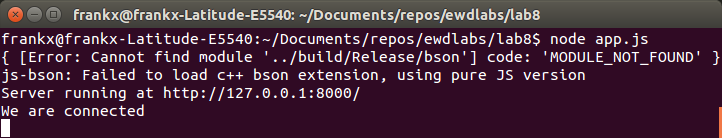
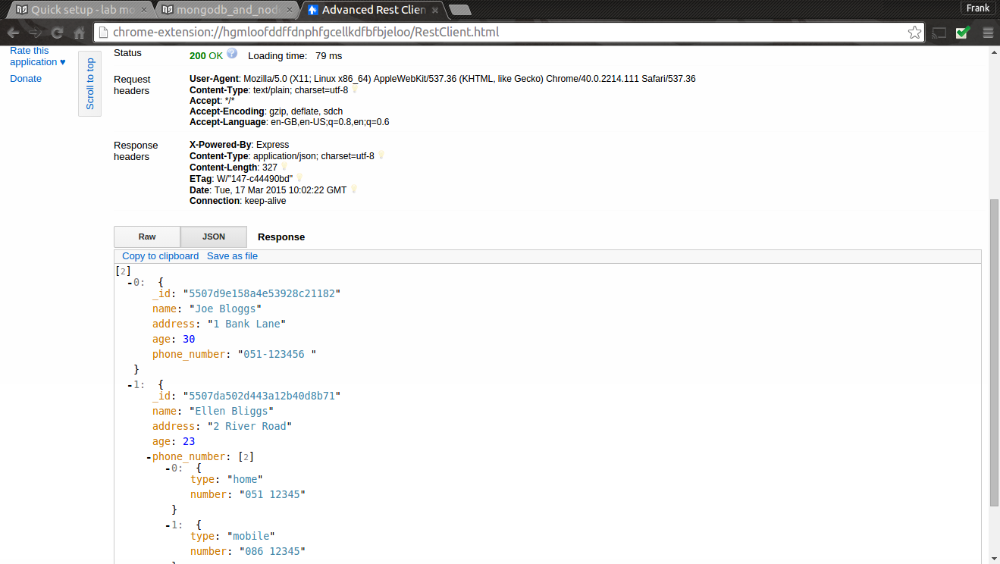

# MongoDB and Node.js

This section requires that you have the web service from  lab 7 completed.
We now want to increase the functionality of the API and add integration to Mongo DB. 

###Set up
Create a new folder called *lab8* and copy the contents from the lab7 folder that you completed last week. Make sure it works to spec. by testing the app with a Rest client. 

###Mongo from Node..js
To add connection capability to Mongo, we need the MongoDB package. Install this package by running ``npm install mongodb --save`` in the *Lab8* folde . The save ensures that the *package.json* file is updated to incude this dependency.
You can get plenty of information about mongodb module at [http://mongodb.github.io/node-mongodb-native/](http://mongodb.github.io/node-mongodb-native/). We will reuse the *contacts* collection from the last section. Make sure you have some data to work with in this collection.

####Connecting to the cloud data store
Last week you were using an in memory collection. We will keep the same API and update the *index.js* file to create a connection to the MongoLab db from your API code.

- First, remove the contents of the *index.js* so that just an empty skeleton of the API remains. Your *index.js* should look like this:

```javascript
// Get list of contacts
exports.index = function(req, res) {
   
} ;

// Creates a new contact in datastore.
exports.create = function(req, res) {
   
};

// Update an existing contact in datastore.
exports.update = function(req, res) {
   
};

// delete an existing contact in datastore.
exports.delete = function(req, res) {
    
};
```
- Add the following code at the first line of *index.js*:
```javascript
var mongo = require('mongodb');
var BSON = mongo.BSONPure;
// get mongo client
var mongoClient = mongo.MongoClient;
var mongoDb;
mongoClient.connect("mongodb://test:ewd15@<YOUR_DOMAIN>.mongolab.com:39311/contacts_db", function(err, db) {
  if(!err) {
    console.log("We are connected");
    mongoDb = db;
  }
  else
  {
  	console.log("Unable to connect to the db");
  }
});
```
This code uses the MongoDB module to create a connection to your database. We will also use the ``BSON`` object,  binary-encoded serialization of JSON-like documents, to encode, decode the Mongo ID. 
For this to work, You will need to update this script so that it connects to your Mongo DB. To do this, get the connection information from MongoLab. See [here](http://docs.mongolab.com/connecting/#connect-string) for more info.
- Now run the service to check if the connection is working. You should see the following in the terminal, command line:


####Get Contact Details
We need to provide the data access logic for each route, modify index.js *index* function to use the data contained in the Mongo database.  Place the following code in the *index* function:
```javascript
	  // Connect to the db
	if (mongoDb){
	  var collection = mongoDb.collection('contacts');
	  collection.find().toArray(function(err, items) {
	  	res.send(items);
	  });
	}
	else
	{
		console.log('No database object!');
	}
```
This code checks the mongoDb exists and, if so, executes a find() query. We chain the toArray() function after the find() to covert the resonse to an array. This is then returned in the response (i.e. ``res.send(items)``
Test with your Rest client by running a HTTP GET request. You should see something similar to the following in the response:

####Create a Contact
Modify the *create* function to create data contained in the Mongo database.  Place the following code in the *create* function:
```javascript
    var contact = req.body;
    console.log('Adding contact: ' + JSON.stringify(contact));
    if (mongoDb){
      var collection = mongoDb.collection('contacts');
      collection.insert(contact, {w:1}, function(err, result) {
            if (err) {
                res.send({'error':'An error has occurred'});
            } else {
                console.log('Success: ' + JSON.stringify(result[0]));
                res.send(result[0]);
            }
        });
    }
  else
  {
    console.log('No database object!');
  }
```
Test that the create contact works by posting the following contact JSON document to the service using a HTTP POST in the Rest Client:
```json
{"name":"Bob Hope","address":"2 Bob Road", "age":55, "phone_number": [{"type":"home","number":"051 12345"}, {"type":"mobile","number":"086 12345"}], "email":"bhope@wit.ie"}
```
All going well, you should see a new contact record in your database. Check this by running a HTTP GET request.
####Update a Contact
- Our update function will update a complete record in the DB. Add the following code to the update function:
```javascript
  var id = req.params.id;
    var contact = req.body;
    console.log('Updating contact: ' + id);
    console.log(JSON.stringify(contact));
    var collection = mongoDb.collection('contacts');
    collection.update({'_id':new BSON.ObjectID(id)}, contact, {safe:true}, function(err, result) {
            if (err) {
                console.log('Error updating contact: ' + err);
                res.send({'error':'An error has occurred'});
            } else {
                console.log('' + result + ' document(s) updated');
                res.send(contact);
            }
    });
```
Test this works as before by updating the last contact(Bob Hope) you entered to the following:
```JSON
{"name":"Bob Hope","address":"22 Bob Road","age":55,"phone_number":[{"type":"home","number":"051 12345"},{"type":"mobile","number":"086 12345"}],"email":"bhope@wit.ie"}
```
####Delete a Contact
- Finally, add the delete functionality by adding the following code to the delee function:
```javascript
    var id = req.params.id;
    console.log('Deleting contact: ' + id);
    var collection = mongoDb.collection('contact');
    collection.remove({'_id':new BSON.ObjectID(id)}, {safe:true},     function(err, result) {
        if (err) {
            res.send({'error':'An error has occurred - ' + err});
        } else {
            console.log('' + result + ' document(s) deleted');
            res.send(req.body);
        }
    });
```
Again, check this works using the Rest client.

####Enhancing the Service.
Enhance the API functions to provide the following:
- Get a contacts details.