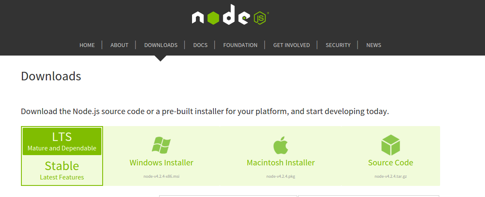

#Get Node

Follow the instructions [here](https://nodejs.org/en/download/)  and download the current **mature and dependable** version of node for your machine.

Install Node on your machine.
Open a command line/terminal window on your machine and enter ``node -v``. It should respond as follows:
```
> node -v
v4.2.4
``` 
**Don't worry if you see a different version number. Node is constantly being improved and it should not affect your progress in this lab.**
