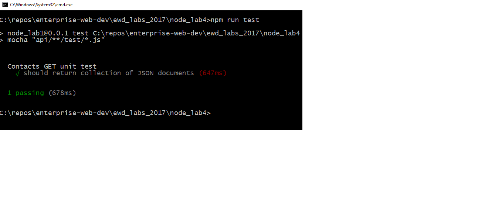

# Set up

+ You need a working version of the Contacts api for this lab. The solution to the last lab you completed will will do. Otherwise, you can get the solution from Github.

+ Create a new folder for this lab, for example *lab-node4* and copy the contents of the last lab into this folder. Update the *name* and *description* properties in **package.json** to *lab-node4*.

### Install dependencies

+ You need **Mocha, Should and SuperTest**. Install as development dependencies into your new lab folder as follows.
```
npm install --save-dev mocha
npm install --save-dev should
npm install --save-dev supertest
```

+ As we are writing code using ES6, we need to be able to transpile our unit tests using Babel. We can use the existing Babel configutratin  for the lab but we need to add *babel-core*. Install *babel-core* as a dev dependency.
```
npm install babel-core
```

### Create First Test

+ To enable us to test the server.js code, we need to export the server object from server.js. We also need to import Mockgoose and the Node_Env variable from the config. Modify the server.js as follows:
```javascript
...
import {Mockgoose} from 'mockgoose';
import {nodeEnv}  from './config';
export const server = express(); //replaces the previous server declaration
...
```
+ Create a ``test`` folder in the root folder of the lab. Create a new file called ``/test/testContactsApi.js``.
```javascript
import supertest from "supertest";
import {server} from  "./../server.js";
import should from "should";
// UNIT test begin
describe("Contacts API unit test",function(){
  this.timeout(120000);//increase timeout of tests to 2 mins. Starting Mockgoose can take time.
  // #1 return a collection of json documents
  it("should return collection of JSON documents",function(done){
    // calling home page api
    supertest(server)
    .get("/api/contacts")
    .expect("Content-type",/json/)
    .expect(200) // This is the HTTP response
    .end(function(err,res){
        // HTTP status should be 200
        res.status.should.equal(200);
        done();
    });
  });
});
```

## Include Mockgoose in server.js

+ Install Mockgoose as a development dependency
```
npm install --save-dev Mockgoose
```

+ In our current solution, in *server.js* we connect to the database with the following statement:
```javascript
...
mongoose.connect(config.mongoDb);
...
```
replace this statement with the following code:
```javascript
...
// Connect to database
if (nodeEnv == 'test'){
  //use mockgoose for testing
	var mockgoose = new Mockgoose(mongoose); 
	mockgoose.prepareStorage().then(()=>{
    mongoose.connect(config.mongoDb);
	});
}
else
{
  //use real deal for everything else
	mongoose.connect(config.mongoDb);
}
mongoose.connection.on('error', function(err) {
    console.error('MongoDB connection error: '+ err);
    process.exit(-1);
});
...
```

This code will wrap the existing Mongoose object with Mockgoose only if the Node_Env is set to test (i.e. we're running test cases).

## Setting ``NODE_ENV``
``NODE_ENV`` is an environment variable. We need to set ``NODE_ENV`` to ‘test’ when we run out  unit tests. We will also need to set it back to 'development' when we're updating the code. Setting environment variables differs across Operating Systems/platforms. *Cross-Env* is an NPM package which uses a single command to set environment variables without worrying about the platform.

+ Install *Cross-Env* as a development dependency:
```
npm install save-dev cross-env
```
#### Nodemon
When we change things in a Node.js project, a restart is required for the changes to be reflected in the running process. This can be very time consuming. Instead of manually restarting Node, we will install the ``nodemon`` package, which can monitor our files and auto-restart Node for us when we save changes to disk.

- Install Nodemon:

> ```script
npm install --save-dev nodemon
```


## Update package.json

+ Replace the script entry in the *package.json* file with the following.
```json
"scripts": {
    "start": "cross-env NODE_ENV=development nodemon --ignore hackerNews/* --exec babel-node server.js",
    "test": "cross-env NODE_ENV=test mocha --compilers js:babel-core/register"
  }
```
The above script entry for test will set ``NODE_ENV`` to test and then run mocha against the files matching the pattern provided (i.e. the test folder). We also updated the start script to set ``NODE_ENV`` to 'development' before starting the server.

+ Now test by running the test script:
```
npm run test
```
You should see something similar to the following:

