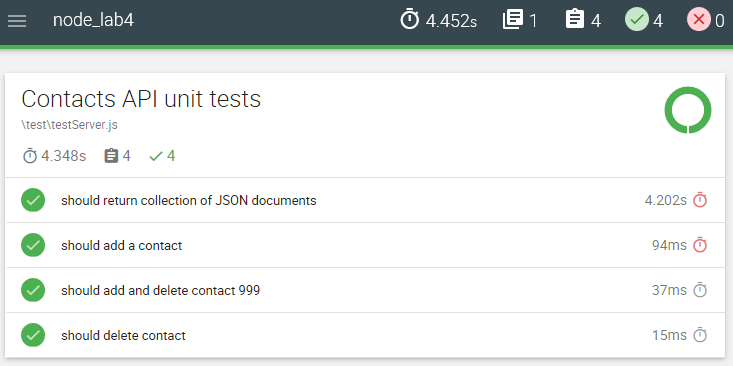

# Report Generation

At the moment, the tests report back to the console. It would be good to generate a unit test report that Visualize your test results. We'll use **Mochawesome** to do this.

+ Install Mochawesome to you dev dependencies.
```
npm install --save-dev Mochawesome
```

+ To output the results, update your test script in *package.json* to the following:
```javascript
"test": "cross-env NODE_ENV=test mocha --compilers js:babel-core/register --reporter mochawesome"
```

+ Now run the tests again. Mochawesome will generate reports in the **/mochawesome-reports/**

