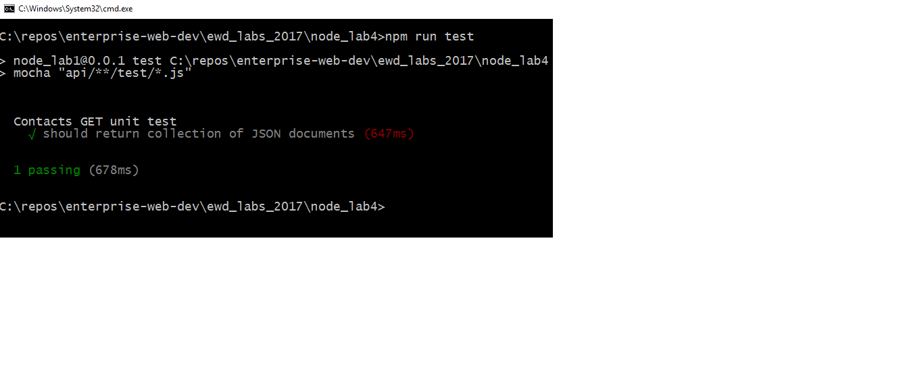

# Set up

+ You need a working version of the Contacts api for this lab. The solution to the last lab you completed will will do. Otherwise, you can get the solution from Github.

+ Create a new folder for this lab, for example *lab-node-testing* and copy the contents of the last lab into this folder.

### Install dependencies
+ You need Mocha, Should and SuperTest. Install as development dependencies into your new lab folder as follows:

```
npm install --save-dev mocha

npm install --save-dev should

npm install --save-dev supertest
```

### Create First Test

+ Create a ``test`` folder in ``/api/contacts`` and create a new file called ``/api/contacts/test/testContacts.js``
+ Insert the following code:

```javascript
var supertest = require("supertest");
var should = require("should");

// This agent refers to PORT where program is runninng.
var server = supertest.agent("http://localhost:8080");

// UNIT test begin

describe("Contacts API unit tests",function(){
  // #1 should return contacts representation in json
  it("should return collection of JSON documents",function(done){

    // calling home page api
    server
    .get("/api/contacts")
    .expect("Content-type",/json/)
    .expect(200) // This is HTTP response
    .end(function(err,res){
      // HTTP status should be 200
      res.status.should.equal(200);
      done();
    });
  });

});
```

## update package.json

+ Add the following script entry to the app's package.json file.

```json
scripts:{  
  "test" : "mocha \"api/**/test/*.js\"",
  ...
}
```
The above script entry will run mocha against the files matching the pattern provided (i.e. all the test folders in the api routing folders)

+ Now test by starting your service and, in the root of the lab folder, run the following

```
npm run test
```

You should see something similar to the following:


